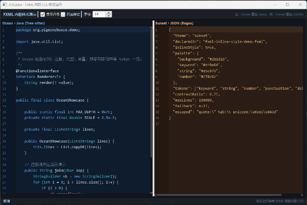

# JFXEditor

[English](README.en.md) | 简体中文

[](https://central.sonatype.com/artifact/io.github.creatoraa/jfxeditor)
[](LICENSE)

基于 **Canvas** 绘制的 JavaFX 原生代码编辑器组件，拥有很高的拓展性，完整支持 **FXML 语法**与 **CSS 样式表**。



## ✨ 特性

- 🎨 **纯 Canvas 渲染** —— 不依赖 TextArea/WebView，高性能自绘编辑器
- 🧩 **Control/Skin 架构** —— 标准 JavaFX 控件，可直接在 FXML 中使用
- 🎭 **完全 CSS 化样式** —— 40+ 个 `-editor-*` CSS 属性，含全部语法 token 配色，支持运行时热切换主题
- 🌈 **语法高亮** —— 内置 Tree-sitter（Java）与正则（Java / JSON）两套高亮引擎，异步高亮不阻塞 UI
- 🔌 **高拓展性** —— 自定义渲染层（RenderLayer）、装饰模型（Decoration）、按键绑定、缩进策略均可插拔
- 📄 **多文档模型** —— 内存文档 / 分页大文件文档，基于 GapBuffer，支持撤销重做
- 🎯 **四套内置主题** —— Dark / Light / Purple / High Contrast

## 📦 环境要求

| 依赖 | 版本 |
| ---- | ---- |
| JDK | 21+ |
| JavaFX | 23.0.1 |
| Maven | 3.x |

## 📥 Maven 依赖

```xml
<dependency>
    <groupId>io.github.creatoraa</groupId>
    <artifactId>jfxeditor</artifactId>
    <version>1.3-preview</version>
</dependency>
```

## 🚀 快速上手

### Java 代码方式

```java
JFXEditor editor = new JFXEditor();
editor.document().setText("public class Demo {}\n");
editor.setHighlighter(TreeSitterHighlighter.forJava()); // 启用语法高亮

// 应用内置主题（场景级或控件级均可）
scene.getStylesheets().setAll(EditorTheme.DARK.getStylesheet());
```

### FXML 方式

```xml
<?import org.pigeonshouse.javafx.editor.editor.JFXEditor?>

<JFXEditor fx:id="editor" VBox.vgrow="ALWAYS">
    <style>
        -editor-background: #0f1c2e;
        -editor-text-color: #cfe3f5;
        -editor-token-keyword: #58a6ff;
        -editor-token-keyword-style: 'bold';
        <!-- 更多 -editor-* 属性... -->
    </style>
</JFXEditor>
```

## 🧱 内置模块

| 模块 | 说明 |
| ---- | ---- |
| `core.document` | 文档模型：GapBuffer、内存/分页文档、撤销重做、行索引 |
| `editor` | 编辑器控件：Control/Skin、光标、装饰层、按键绑定、渲染层、缩进策略 |
| `syntax` | 语法高亮：Tree-sitter 与正则高亮器、异步高亮引擎、主题 |
| `search` | 文本搜索引擎 |

## 🖥️ 运行演示

演示程序位于 [demos/](demos) 目录，是三个独立的 Maven 工程（依赖 Maven Central
上的 jfxeditor 构件，不随本库打包发布）：

| 工程 | 演示内容 |
| ---- | ---- |
| `demos/jfxeditor-demo-fxml` | FXML 内联 -editor-* 样式（Ocean / Sunset 双编辑器） |
| `demos/jfxeditor-demo-css` | 四套主题运行时切换 + 编辑 themes/ 下 CSS 即时热加载 |
| `demos/jfxeditor-demo-richtext` | 标记语法实时渲染为行间组件（图片/表格/链接/文件索引等） |

```bash
# 进入任意演示工程目录启动，例如：
cd demos/jfxeditor-demo-css
mvn javafx:run
```

> 若本地仓库中没有对应版本的 jfxeditor 构件，先在库根目录执行 `mvn install`。

## 📄 开源协议

本项目基于 [MIT License](LICENSE) 开源。
